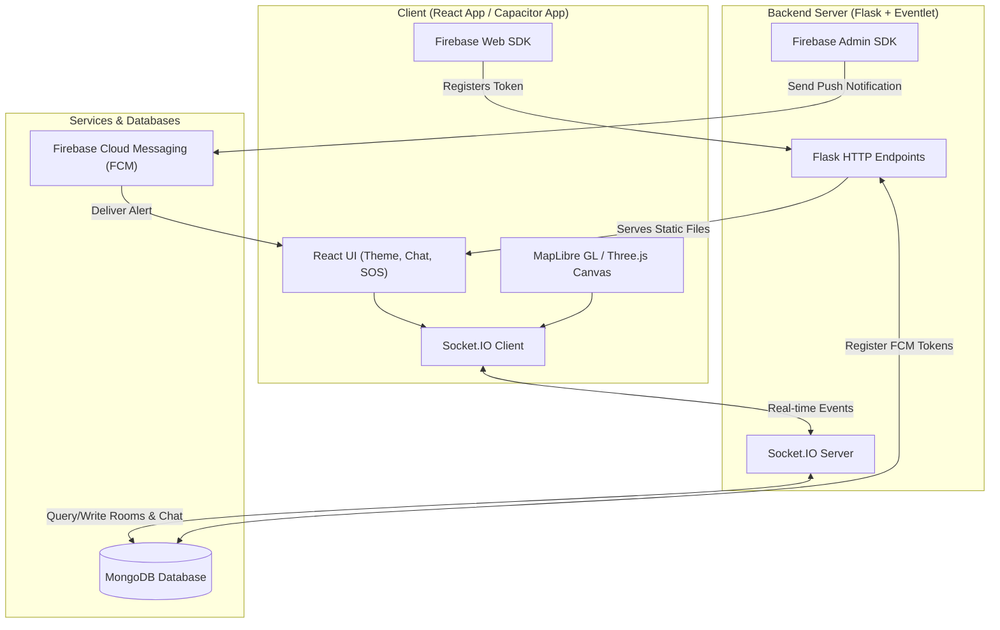

# Orbit : Real-Time Tracking, Chat, and Safety App

Orbit is a web, app and mobile-capable real-time tracking, chat, and safety tracking application. It enables users to share their live location on an interactive 3D map, communicate in room-based chat channels, and trigger instant distress signals (SOS) with automated push notifications. 

**Live Deployment URL:** [Click Here](https://orbit-bice-gamma.vercel.app/)

---

## Features

- **Real-Time Location Tracking:** Stream live latitude, longitude, and heading (device compass) to other members within a room.
- **Interactive 3D Map View:** Renders maps with 3D buildings, dynamic sky effects, and volumetric fog presets using MapLibre GL.
- **Perspective Camera Modes:** Switch between 2D Top-down, 3D Cinematic (Front View), and Immersive (Close View) with device orientation integration.
- **Room Management:** Create or join private/public rooms using 5-character room codes.
- **Live Room Chat:** Real-time messages with seen receipts (single check for sent, double check for read).
- **Emergency SOS Distress System:** Trigger an SOS alert to broadcast visual warnings on active users' maps and dispatch Web Push notifications (FCM) to all members of the room.
- **Invisible Mode:** Conceal your live location on the map while remaining active in the room.
- **Native Mobile Support:** Wrapped with Capacitor for Android deployment.
- **Aesthetic Dark/Light Modes:** Clean, modern interface with smooth micro-animations.

---

## Tech Stack

### Frontend
- **Framework:** React 19
- **3D & Maps:** MapLibre GL (`maplibre-gl`), React Three Fiber (`@react-three/fiber`), Drei (`@react-three/drei`), and Three.js (`three`)
- **Real-Time Communication:** Socket.IO Client (`socket.io-client`)
- **Push Notifications:** Firebase SDK (`firebase`)
- **Animations:** Framer Motion (`framer-motion`) and Lenis (`lenis`) for smooth scrolling
- **Icons:** Lucide React (`lucide-react`)
- **Styling:** Vanilla CSS with theme configuration stylesheets
- **Mobile Wrapper:** Capacitor (`@capacitor/core`, `@capacitor/cli`, `@capacitor/android`)

### Backend
- **Language/Environment:** Python 3
- **Web Framework:** Flask
- **Concurrency & WebSockets:** Flask-SocketIO & Eventlet
- **Database Driver:** PyMongo (MongoDB Client)
- **Push Notification Admin:** Firebase Admin SDK (`firebase-admin`)
- **WSGI Production Server:** Gunicorn with Eventlet workers

### Database
- **MongoDB:** Stores rooms, messages (with a 24-hour Time-To-Live index for security), room memberships, and registered FCM device tokens.

---

## Architecture



---

## Environment Variables

### Backend Environment Variables
Create a `.env` file inside the `backend` directory or configure these variables in your hosting provider's dashboard:

| Variable | Description | Default |
| :--- | :--- | :--- |
| `MONGO_URI` | MongoDB connection string. | `mongodb://localhost:27017` |
| `MONGO_SERVER_SELECTION_TIMEOUT_MS` | MongoDB client server selection timeout in ms. | `5000` |
| `FIREBASE_SERVICE_ACCOUNT` | JSON string of the Firebase service account credential. | *Fallback debug configuration* |
| `PORT` | Port number the Flask app runs on. | `5000` |

### Frontend Environment Variables
Create a `.env` file inside the `frontend` directory:

| Variable | Description | Default / Example |
| :--- | :--- | :--- |
| `REACT_APP_BACKEND_URL` / `VITE_BACKEND_URL` | Base URL of the backend Flask server. | `https://orbit-g4ah.onrender.com` |
| `REACT_APP_FIREBASE_ENABLED` / `VITE_FIREBASE_ENABLED` | Toggles Firebase integration. | `false` |
| `REACT_APP_FIREBASE_API_KEY` | Firebase Client API Key. | `PASTE_REAL_FIREBASE_API_KEY_HERE` |
| `REACT_APP_FIREBASE_AUTH_DOMAIN` | Firebase Auth Domain. | `PASTE_REAL_FIREBASE_AUTH_DOMAIN_HERE` |
| `REACT_APP_FIREBASE_PROJECT_ID` | Firebase Project ID. | `PASTE_REAL_FIREBASE_PROJECT_ID_HERE` |
| `REACT_APP_FIREBASE_STORAGE_BUCKET` | Firebase Storage Bucket. | `PASTE_REAL_FIREBASE_STORAGE_BUCKET_HERE` |
| `REACT_APP_FIREBASE_MESSAGING_SENDER_ID` | Firebase Messaging Sender ID. | `PASTE_REAL_FIREBASE_MESSAGING_SENDER_ID_HERE` |
| `REACT_APP_FIREBASE_APP_ID` | Firebase App ID. | `PASTE_REAL_FIREBASE_APP_ID_HERE` |
| `REACT_APP_FIREBASE_MEASUREMENT_ID` | Firebase Measurement ID. | `PASTE_REAL_FIREBASE_MEASUREMENT_ID_HERE` |
| `REACT_APP_FIREBASE_VAPID_KEY` | Web Push VAPID public key. | `PASTE_REAL_WEB_PUSH_VAPID_KEY_HERE` |

---

## API Details

### REST API Endpoints

- **`GET /api/rooms`**
  - Returns a list of active rooms.
- **`GET /api/rooms/indexes`**
  - Developer route showing current database indexes.
- **`DELETE /api/rooms/nuke`**
  - Resets and clears the rooms and room memberships collections.
- **`POST /api/notifications/register`**
  - Saves a user's browser FCM token to MongoDB.
  - Body: `{"userId": "string", "username": "string", "token": "string", "platform": "string"}`
- **`POST /api/notifications/unregister`**
  - Removes a user's FCM token.
  - Body: `{"token": "string"}`
- **`GET /api/notifications/debug`**
  - Returns raw registered tokens (Developer use).
- **`GET /api/notifications/health`**
  - Checks if Firebase SDK credentials are correctly initialized.
- **`GET /<path>`**
  - Catch-all route to serve the React single-page application and static files.

### Socket.IO Real-Time Events

- **`connect`**: Handshakes connection.
- **`create_room`**: Initializes a room with a unique name.
- **`join_room`**: Subscribes the user session to a room.
- **`rejoin_room`**: Resubscribes users on network reconnection.
- **`check_room`**: Checks if a target room exists.
- **`send_location`**: Transmits live coordinates `{"lat", "lng", "heading", "accuracy"}` to room members.
- **`set_invisible`**: Toggles visibility, filtering out coordinates from live map broadcast.
- **`send_message`**: Sends a new text message. Saves message to MongoDB (expires after 24h).
- **`message_seen`**: Updates message status with seen receipts.
- **`sos_alert`**: Triggers emergency visual alerts and pushes FCM push notifications to all offline/minimized members of the room.
- **`sos_cancel`**: Broadcasts cancellation of distress alerts.
- **`disconnect`**: Cleans up active room listings.

---

## Setup Instructions

### 1. Prerequisites
- Python 3.10+ installed
- Node.js 18+ and npm installed
- MongoDB running locally (default: `mongodb://localhost:27017`) or a MongoDB Atlas URI

### 2. Backend Setup
1. Open a terminal and navigate to the backend directory:
   ```bash
   cd backend
   ```
2. Create and activate a virtual environment:
   ```bash
   python -m venv venv
   # On Windows:
   venv\Scripts\activate
   # On macOS/Linux:
   source venv/bin/activate
   ```
3. Install dependencies:
   ```bash
   pip install -r requirements.txt
   ```
4. Start the backend:
   ```bash
   python app.py
   ```
   The backend will run on `http://localhost:5000`.

### 3. Frontend Setup
1. Open another terminal and navigate to the frontend directory:
   ```bash
   cd frontend
   ```
2. Install npm dependencies:
   ```bash
   npm install
   ```
3. Start the Vite/React development server:
   ```bash
   npm start
   ```
   The frontend will run on `http://localhost:3000`.

### 4. Production Build (Local Run)
If you want the Flask server to host the built React frontend locally:
1. Navigate to the frontend directory and build the production assets:
   ```bash
   cd frontend
   ```
2. Run build script:
   ```bash
   npm run build
   ```
3. Ensure the built folder is located at `frontend/build`.
4. Run the Flask backend:
   ```bash
   cd ../backend
   python app.py
   ```
   Open `http://localhost:5000` to access the application.
